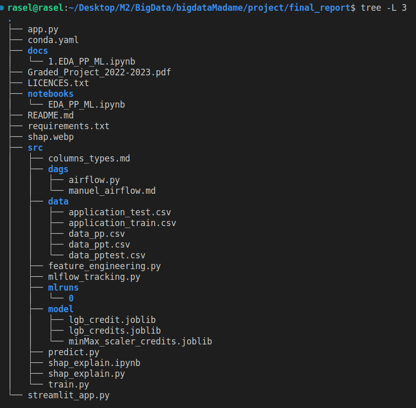

# RASOLOARIVONY ELYSE
## EFREI M2 App BDIA

### dispostion des fichiers
 

### 1. Objectifs : 

Le but de ce projet est d'appliquer les concepts et les outils vus en cours pour construire un projet de classification du risque de crédit à la maison en utilisant les données fournies. Il se compose de 3 parties: 1) construction de projets de machine learning classiques avec respect aux bonnes pratiques de codage, 2) intégration de MLFlow pour suivre les paramètres et les métriques du modèle, et 3) intégration de SHAP pour expliquer les prédictions du modèle. Par ailleurs, ici j'ai rajouté plusieurs fonctionnalités (streamlit, flask, airflow, eli5, lime, etc).

### 2. Les differentes sources:
* [Features selection](https://medium.com/analytics-vidhya/feature-selection-extended-overview-b58f1d524c1c)
* [Notre repository github](https://github.com/ELYSE-GIT/AIproject/tree/main) ( [ex4](https://www.analyticsvidhya.com/blog/2020/10/feature-selection-techniques-in-machine-learning/) )
* [Sources de données sur kaggle](https://www.kaggle.com/c/home-credit-default-risk/data)
* [Cookiecutter](https://medium.com/worldsensing-techblog/project-templates-and-cookiecutter-6d8f99a06374)
* [Sphinx](https://www.sphinx-doc.org/en/master/tutorial/getting-started.html)
* [MLfow](https://github.com/mlflow/mlflow) ( [ex1](https://medium.com/techfitlab/mlflow-for-managing-the-end-to-end-machine-learning-lifecycle-9efff9094dda), [ex2](https://towardsdatascience.com/mlflow-part-1-getting-started-with-mlflow-8b45bfbbb334) )
* [Airflow](https://medium.com/analytics-vidhya/apache-airflow-what-it-is-and-why-you-should-start-using-it-c6334090265d), [Airflow Docker](https://towardsdatascience.com/10-minutes-to-building-a-machine-learning-pipeline-with-apache-airflow-53cd09268977), [Data pipeline](https://towardsdatascience.com/improve-your-data-preprocessing-with-columntransformer-and-pipelines-b6ff7edd2f77)

* Models [xgboost](https://machinelearningmastery.com/random-forest-ensembles-with-xgboost/)


* [Deploy on GCP](https://towardsdatascience.com/10-minutes-to-deploying-a-deep-learning-model-on-google-cloud-platform-13fa56a266ee)

### 3. Utilisation d'un environnement virtuel
Pour pouvoir utiliser ce repository, je vous conseille d'installer un environnement virtuel
```
virtualenv projenv
source projenv/bin/activate
pip install -r requirements.txt
```

### 3. Resume de ce qui a à faire

Voici un résumé des tâches à effectuer pour chaque partie de ce projet :

Partie 1 :

    Construire un projet de ML pour la classification de risque de crédit à la consommation en utilisant les données fournies
    Utiliser GIT pour la collaboration d'équipe, la version de code et de modèle
    Séparer le flux de travail du projet ML en différents scripts (préparation des données, ingénierie des caractéristiques, entraînement des modèles, prédiction)
    Utiliser un gabarit ou en définir un vous-même pour organiser votre projet
    Utiliser un environnement conda pour toutes vos bibliothèques, moi personnellement j'ai utilisé virtualenv 
    Proposer une solution pour planifier votre pipeline ML (facultatif) : j'ai pris airflow

Partie 2 :

    Installer MLFlow dans votre environnement virtuel python
    Suivre les paramètres et les métriques de votre modèle et afficher les résultats dans votre UI MLFlow local (plusieurs exécutions)
    Empaqueter votre code dans un format de modèle réutilisable et reproductible avec les projets MLFlow
    Déployer votre modèle dans un serveur REST local pour permettre de faire des prédictions (facultatif)
    --> accéder dans src et tapez 
    ```
    mlflow ui
    ```

Partie 3 :

    Installer SHAP dans votre environnement python
    Utiliser SHAP pour expliquer les prédictions de votre modèle
    Construire un TreeExplainer et calculer les valeurs Shaplay
    Visualiser les explications pour un point spécifique de votre jeu de données
    Visualiser les explications pour tous les points de votre jeu de données à la fois
    Visualiser un résumé pour chaque classe sur l'ensemble des données


APPLICATION : 
# Lancer l'application Flask
```bash
export FLASK_APP=app.py
flask run
```

# Lancer l'application Streamlit
```bash
streamlit run streamlit_app.py
```

Vous devriez maintenant pouvoir accéder à l'application Flask en utilisant l'URL http://localhost:5000, et l'application Streamlit en utilisant l'URL http://localhost:8501.

Si vous voulez les lancer en même temps, vous pouvez utiliser un outil comme nohup ou screen pour les lancer en arrière-plan et continuer à utiliser votre terminal :
```bash
nohup flask run &
nohup streamlit run streamlit_app.py &
```

